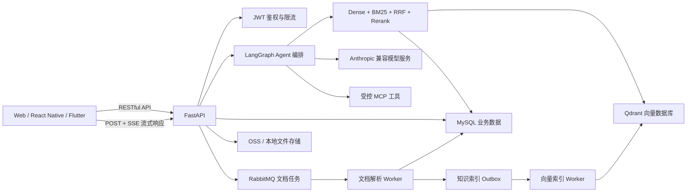

# Python Agent + RAG 项目面试实战讲解

> 适用项目：`python-agent-demo` 后端及其 Web、React Native、Flutter 客户端  
> 文档目标：面试时能从真实业务问题出发，说明为什么这样设计、如何实现、如何保证准确性，以及后续如何演进。

## 1. 项目定位与业务背景

该项目不是单纯调用大模型的聊天 Demo，而是一个带有用户知识库、文件解析、会话记忆、工具调用和流式输出能力的 Agent 系统。

典型业务场景包括：

- 企业员工查询报销、请假、合同、售后等内部制度；
- 客服根据产品手册和订单规则回答用户问题；
- 用户上传 PDF、Word、图片后进行解析、OCR、入库和问答；
- Agent 调用计算器等受控工具完成确定性任务；
- 多端客户端实时显示模型输出，并允许用户随时停止生成；
- 每个用户只能检索自己的知识数据，防止租户间数据泄漏。

项目核心问题不是“模型能不能回答”，而是：

1. 回答是否基于企业最新知识；
2. 检索结果是否准确；
3. 找不到答案时是否会拒答；
4. 流式请求中断后会不会继续写入错误消息；
5. 文件入库、向量索引和业务数据能否保持最终一致；
6. 本地、测试和生产环境能否安全隔离。

## 2. 整体技术架构



一次知识问答的主要链路：

1. 客户端通过 `POST /agent/chat/stream` 提交问题和会话 ID；
2. 服务端鉴权并确认用户身份；
3. 读取当前用户的会话记忆和知识数据；
4. Qdrant 执行稠密向量召回，BM25 执行稀疏关键词召回；
5. 使用 RRF 合并两个召回集合；
6. Reranker 对候选结果进行二阶段精排；
7. 置信度门禁判断是否允许把知识块交给模型；
8. Agent 将可靠上下文、历史消息和用户问题组织成 Prompt；
9. 模型输出通过 SSE 增量返回；
10. 完整回答成功后再保存消息，断开或取消时不允许旧请求覆盖新会话。

## 3. 为什么选 Qdrant 向量数据库

### 3.1 当前项目的实际需求

项目需要保存文档切块后的 Embedding，并满足：

- 支持高维向量相似度搜索；
- 支持按 `owner_id` 过滤，形成严格的多租户边界；
- 支持为向量附加 `note_id`、文本块等 Payload；
- 支持 HNSW 近似最近邻检索；
- Python SDK 和 HTTP API 成熟；
- 可以 Docker 私有化部署；
- 中小规模阶段维护成本可控；
- 后续可以独立扩缩容，不拖累 MySQL。

Qdrant 与这些需求匹配，因此本项目将 MySQL 作为业务事实库，将 Qdrant 作为派生的检索索引。

### 3.2 为什么不把业务数据全部放入向量库

向量数据库擅长相似度检索，但不适合替代关系数据库处理用户、会话、消息、任务状态和事务。

本项目的职责划分是：

| 数据 | 存储位置 | 原因 |
|---|---|---|
| 用户、会话、消息、笔记 | MySQL | 需要事务、约束、关联查询和可靠持久化 |
| 文档原文件 | OSS 或文件存储 | 适合大对象存储和签名访问 |
| 文档向量、分块 Payload | Qdrant | 适合 ANN 相似度搜索和元数据过滤 |
| 异步任务 | RabbitMQ + MySQL 状态表 | 削峰、重试、死信和任务可追踪 |

Qdrant 中的向量可以删除后重新从 MySQL 构建，因此它不是唯一事实来源。这能降低索引损坏和数据迁移的风险。

### 3.3 与其他方案的比较

| 方案 | 优点 | 局限 | 适用场景 |
|---|---|---|---|
| Qdrant | 向量能力专业、过滤方便、部署轻量、Python 生态成熟 | 多一个基础设施组件 | 当前项目、中小型独立 RAG 服务 |
| pgvector | 关系数据和向量在同一事务中，架构简单 | 大规模 ANN 会与 OLTP 争抢资源 | 已使用 PostgreSQL、数据量较小的系统 |
| Milvus | 面向大规模向量、高吞吐和分布式扩展 | 组件多、运维复杂 | 亿级向量和大型检索平台 |
| Elasticsearch/OpenSearch | BM25、过滤、聚合、向量搜索统一 | 资源消耗和调优成本较高 | 搜索业务本来就依赖 ES，强调全文检索 |
| 云托管向量库 | 少运维、扩容方便 | 成本、网络、供应商绑定和数据合规 | 团队缺少运维能力、允许公有云托管 |

面试中的回答方式：

> 我没有因为“向量数据库流行”就直接选择 Qdrant，而是先根据数据规模、多租户过滤、私有化部署和团队运维成本做权衡。当前系统以 MySQL 为事实库，Qdrant 只承担可重建的向量索引，既发挥专用向量库的检索能力，又避免把事务数据错误地放进向量库。若项目本身使用 PostgreSQL 且数据量不大，我会优先考虑 pgvector；若达到亿级向量，再评估 Milvus。

## 4. 稠密向量与稀疏向量的底层原理

### 4.1 稠密向量 Dense Retrieval

Embedding 模型将文本编码为固定维度的浮点数组。例如“退款多久到账”和“退款到账时间”虽然字面不同，但语义向量可能非常接近。

常用余弦相似度：

```text
cos(q, d) = (q · d) / (||q|| × ||d||)
```

如果向量已经归一化，余弦相似度可以近似简化为点积。真实检索不会遍历比较所有向量，而是使用 HNSW 等 ANN 索引。

HNSW 可以理解为多层“小世界图”：

- 上层节点少，负责快速跳转到大致区域；
- 下层节点多，负责在局部寻找更近结果；
- 查询速度远快于全量暴力搜索；
- 代价是结果属于近似最近邻，需要通过参数在召回率、内存和延迟之间权衡。

Dense 的优势是语义理解，弱点是：

- 对订单号、错误码、产品型号等精确关键词不一定稳定；
- Embedding 模型不适配业务领域时可能产生语义偏移；
- 相似不代表答案正确，不能只看一个向量分数。

### 4.2 稀疏向量 Sparse Retrieval

本项目使用 BM25 表达稀疏检索。它基于倒排索引和关键词统计，核心考虑：

- TF：某个词在当前文档出现多少次；
- IDF：词在整个文档集合中有多稀有；
- 文档长度归一化：避免长文档因词多天然占优；
- 词频饱和：一个词重复很多次后，增益逐渐降低。

直观公式：

```text
BM25(q, d) = Σ IDF(t) × TF(t,d) × (k1 + 1)
              / (TF(t,d) + k1 × (1 - b + b × |d| / avgdl))
```

Sparse 的优势是精确匹配，特别适合：

- `ERR-1007` 错误码；
- 商品 SKU；
- 合同编号；
- 人名、机构名和专业术语。

它的弱点是不理解同义表达。例如“怎么退钱”和“退款流程”可能无法仅靠关键词得到理想召回。

### 4.3 为什么必须混合检索

业务用户的问题既可能是自然语言，也可能包含精确实体。因此只使用一种检索方式会产生明显短板：

- Dense 解决“说法不同、含义相近”；
- Sparse 解决“关键词必须完全命中”；
- Hybrid 同时保留语义召回与精确召回。

本项目使用 Reciprocal Rank Fusion 合并结果：

```text
RRF(d) = Σ 1 / (k + rank_i(d))
```

RRF 主要利用名次，而不是直接相加原始分数。因为向量相似度和 BM25 分数不在同一个量纲，直接做 `0.5 × dense + 0.5 × bm25` 很难设置稳定权重。

## 5. 如何保证 RAG 检索准确性

### 5.1 不能只依赖 TopK

TopK 的含义只是“从现有内容里选最接近的 K 条”，即使知识库完全没有答案，也一定可能返回若干结果。因此本项目使用完整的检索质量链路：

```text
问题标准化
  → Dense + Sparse 多路召回
  → RRF 融合
  → 去重
  → Rerank 精排
  → Top Score 门槛
  → 综合置信度门槛
  → Top1/Top2 分差检查
  → 可靠上下文或拒答
```

### 5.2 Rerank 的作用

第一阶段召回优先保证“不漏掉”，候选一般较多；Reranker 同时读取问题和候选文本，判断该文本是否真的能回答问题。

本项目提供两种方式：

- `hybrid`：结合 Dense、BM25、RRF、标题和关键词覆盖率，速度快，无额外模型；
- `cross_encoder`：使用 `BAAI/bge-reranker-base` 对问题与文档联合编码，准确性通常更高，但增加推理延迟和资源消耗。

生产选择建议：

- 低成本或开发环境使用 Hybrid；
- 法律、金融、企业制度等高准确性场景使用 Cross-Encoder；
- 先召回 20～50 条，再 Rerank 到 3～5 条，避免把所有文档交给重排模型；
- 根据离线评测确定阈值，不靠主观猜测。

### 5.3 错误结果如何处理

| 问题 | 处理方案 |
|---|---|
| 知识库没有答案 | 触发 `no_candidate`，明确拒答或引导用户补充信息 |
| Top1 分数太低 | `top_score_below_threshold`，不将结果注入 Prompt |
| 综合置信度不足 | `confidence_below_threshold`，记录日志并进入问题样本集 |
| Top1 与 Top2 接近 | 标记 `ambiguous_candidates`，让用户澄清或扩大上下文 |
| 中文偶然共享单字 | 使用查询词覆盖率过滤弱 BM25 证据 |
| 文档内容过期 | 文档增加版本、生效时间和状态过滤，旧版本停止召回 |
| 多租户串数据 | Qdrant 查询强制附带 `owner_id` Filter，服务端不信任客户端 owner_id |
| 向量库暂时故障 | 记录异常，降级到本地词法检索；不能将故障伪装成可靠答案 |
| 模型仍然幻觉 | Prompt 要求仅依据上下文回答，并返回引用；低置信度时不提供上下文 |

诊断接口 `POST /knowledge/search/diagnostics` 会返回各阶段分数、置信度及拒答原因，方便阈值调优和面试演示。

### 5.4 如何建立评测闭环

线上准确率不能只靠“感觉不错”，需要建立标注集：

```text
用户问题 + 标准相关文档 + 标准答案 + 是否应该拒答
```

检索层重点指标：

- Recall@K：正确文档是否进入候选集合；
- MRR：正确文档第一次出现的排名；
- NDCG：多个相关结果的排序质量；
- No-answer Accuracy：无答案问题能否正确拒答。

生成层重点指标：

- Faithfulness：答案是否能被引用上下文支持；
- Answer Relevance：是否真正回答了问题；
- Citation Accuracy：引用是否与结论一致；
- 人工解决率、转人工率和用户追问率。

线上发现错误后，应保存脱敏的问题、召回结果、分数、模型回答和用户反馈，经过人工审核后进入回归集，而不是直接把错误日志拿去微调。

## 6. RAG Hook 在项目中的作用

RAG Hook 不是某个固定产品，而是一组可插拔的检索生命周期扩展点。本项目设置：

- `before_retrieve`：查询标准化、同义词扩展、权限条件注入；
- `after_retrieve`：去重、业务状态过滤、版本过滤；
- `after_rerank`：加入部门权限、时效性等业务加权；
- `on_low_confidence`：埋点、告警、人工审核或引导用户澄清。

例如企业制度场景中，“差旅报销”存在 2025 和 2026 两个版本。向量相似度可能同时召回两个版本，此时可以在 `after_retrieve` Hook 中根据 `effective_at` 和 `status=active` 删除旧制度，而不需要修改通用向量检索代码。

Hook 的价值在于高内聚低耦合：检索算法负责“相关性”，业务 Hook 负责“这条结果在当前业务条件下能不能使用”。

## 7. Prompt、RAG、微调分别适合什么问题

| 方案 | 解决的问题 | 不适合解决的问题 | 项目示例 |
|---|---|---|---|
| Prompt 工程 | 角色、格式、步骤、约束、工具选择 | 大量私有知识、稳定改变模型能力 | 要求答案包含结论、依据和引用 |
| RAG | 私有知识、实时更新、可引用和可删除 | 固定语言风格、模型本身能力缺失 | 查询最新报销制度和产品文档 |
| 微调 | 固定风格、结构化输出、领域任务习惯 | 高频变化事实、需要精确引用的知识 | 稳定输出客服话术或特定 JSON 结构 |

判断顺序：

1. 能否用清晰 Prompt 解决？能就先用 Prompt；
2. 问题是否来自外部或经常更新的知识？是就使用 RAG；
3. 是否有大量高质量样本，且目标是稳定行为而非记忆事实？满足后再微调。

### 7.1 RAG + 微调如何组合

正确组合不是“把企业文档全部微调进模型”，而是：

- RAG 提供实时、可追溯的事实；
- 微调让模型学会如何使用上下文、如何拒答、如何输出业务格式；
- Prompt 描述本次任务和硬性约束。

本项目只有在 RAG 结果通过置信度门禁时，才允许路由到配置的微调模型。没有可靠知识时继续使用基础模型或拒答，避免微调模型凭训练记忆编造答案。

### 7.2 微调落地流程

1. 明确目标，例如“根据检索上下文输出统一客服结构”；
2. 收集并脱敏真实业务样本；
3. 清理互相冲突、错误和过期答案；
4. 划分训练集、验证集、测试集，避免相似问题泄漏；
5. 先建立基础模型 + Prompt + RAG 基线；
6. 使用 LoRA/QLoRA 做参数高效微调；
7. 对比任务成功率、事实一致性、拒答率、延迟和成本；
8. 灰度发布并保留快速回滚能力。

LoRA 通过训练低秩矩阵近似权重增量，减少显存和训练参数；QLoRA 再将基础模型量化，进一步降低训练资源。但参数效率高不等于数据要求低，错误训练数据仍会稳定地教坏模型。

## 8. RESTful、SSE 与 WebSocket 的区别

这三个概念不是完全同一层面的替代关系：RESTful 是 API 资源设计风格；SSE 和 WebSocket 更侧重长连接下的数据传输方式。

### 8.1 核心对比

| 对比项 | RESTful HTTP | SSE | WebSocket |
|---|---|---|---|
| 通信模式 | 一次请求、一次响应 | 客户端请求，服务端持续单向推送 | 客户端与服务端全双工通信 |
| 协议 | HTTP | HTTP，`text/event-stream` | HTTP Upgrade 后进入 WebSocket 协议 |
| 数据格式 | JSON、文件等 | 文本事件，常承载 JSON | 文本或二进制帧 |
| 客户端发送消息 | 每次重新发 HTTP 请求 | 通常仍通过独立 HTTP 请求 | 可在同一连接持续发送 |
| 自动重连 | 由调用方处理 | 原生 `EventSource` 支持，但 POST 场景需自行实现 | 需要自行实现心跳、重连和状态恢复 |
| 代理与网关兼容 | 最好 | 较好，但需关闭缓冲并延长超时 | 需要网关明确支持 Upgrade |
| 服务端复杂度 | 低 | 中 | 高，需要连接和会话状态管理 |
| 典型场景 | CRUD、登录、查询、上传 | AI Token、通知、日志、进度 | 即时聊天、协作编辑、游戏、音视频信令 |

### 8.2 本项目为什么使用 SSE

模型生成阶段的数据方向主要是服务端到客户端：用户提交一次问题，服务端连续返回思考步骤、Token、表单和完成事件。

当前事件包括：

```text
session   会话建立或恢复
thinking  当前处理阶段
delta     模型增量文本
form      需要用户确认的受控表单
done      消息保存完成
error     流式处理失败
```

因此 SSE 比 WebSocket 更合适：

- 直接使用现有 HTTP 鉴权、限流和日志链路；
- FastAPI 可以用 `StreamingResponse` 逐段输出；
- 经过 Nginx 等网关时配置相对简单；
- 客户端只需解析事件流，不需要维护双向 Socket 状态机；
- 发生错误时仍能使用标准 HTTP 状态和服务端日志体系。

本项目不是使用浏览器原生 `EventSource`，而是使用 `fetch POST` 读取 SSE。原因是请求需要携带 JSON 问题、会话 ID和 Authorization Header，而原生 `EventSource` 主要面向 GET，且自定义 Header 受限。

### 8.3 为什么聊天没有直接用 WebSocket

“聊天应用”不代表一定要 WebSocket。关键要看同一连接是否需要高频双向数据。

本项目的用户输入频率低，每轮只发送一次请求，模型输出才是连续数据，所以 HTTP POST + SSE 已经满足需求。WebSocket 会额外引入：

- 连接鉴权和 Token 续期；
- 心跳、断线检测和指数退避重连；
- 多实例部署下的连接路由；
- 消息确认、顺序、重放和幂等；
- 网关 Upgrade 配置；
- 服务端连接数和背压管理。

如果后续增加多人实时协作、双向语音、服务端主动唤醒、打字状态或同一连接上的高频工具交互，再切换或补充 WebSocket 更合理。

### 8.4 哪些接口继续使用 RESTful

本项目以下操作更适合普通 RESTful API：

- 登录、注册；
- 笔记增删改查；
- 查询会话历史；
- 文件上传和任务状态查询；
- 提交受控表单；
- RAG 检索诊断。

这些操作都有明确完成边界，不需要持续推送，使用普通 JSON 响应更简单、更容易缓存、测试和监控。

## 9. SSE 的生产实现重点

### 9.1 事件格式

标准事件示例：

```text
event: delta
data: {"content":"退款"}

event: delta
data: {"content":"将在 3 个工作日内到账"}

event: done
data: {"message_id":123}

```

每个事件以空行结束。数据先序列化为 JSON，不能通过简单字符串拼接处理换行和引号。本项目为 SSE 编码编写了自动化测试。

### 9.2 用户随时停止生成

客户端通过 `AbortController` 或移动端等价取消对象终止当前 HTTP 请求。服务端在检测到流断开后停止向客户端写入，并让上游模型流尽快关闭。

仅仅隐藏“停止按钮”是不够的，还需要：

- 一个会话只维护当前活动请求引用；
- 新请求开始前取消旧请求；
- 每次请求生成唯一 `requestId`；
- 收到 `delta/done/error` 时确认它仍是当前请求；
- 被取消的请求不能保存半截助手消息；
- 页面卸载、切换账号或切换会话时取消请求。

### 9.3 防止历史消息覆盖新消息

典型竞态：用户进入会话后开始加载历史记录，同时立即发出新问题；历史请求较晚返回，若直接执行 `setMessages(history)`，就会覆盖刚刚产生的新消息。

解决方式：

1. 历史加载也使用可取消请求；
2. 保存加载时的 `sessionId` 和 `historyRequestId`；
3. 返回后确认页面仍处于同一会话；
4. 只有尚未开始新一轮发送时才整体替换；
5. 已产生新消息时按消息 ID 合并去重，而不是覆盖数组；
6. Reducer 中拒绝处理已经过期的流事件。

可用状态规则表示：

```text
只有 event.requestId == activeRequestId
并且 event.sessionId == currentSessionId
才允许更新当前聊天状态
```

### 9.4 网关与部署配置

生产环境需要注意：

- 禁止 Nginx 对 SSE 响应做缓冲，否则 Token 会积累后一次性显示；
- 延长 `proxy_read_timeout`；
- 设置 `Cache-Control: no-cache`；
- 让负载均衡的空闲连接超时大于模型最大响应时间；
- 定期发送注释或心跳，避免长时间无 Token 时连接被关闭；
- 限制单用户并发流数量，防止连接资源被滥用；
- 记录首 Token 延迟 TTFT、总耗时、断开率和错误率；
- 不要在 SSE 流开始后再指望修改 HTTP 状态码，业务错误应通过 `error` 事件传递。

## 10. 文件入库与索引一致性

用户上传文件后，接口不应同步完成 OCR、切块、Embedding 和索引，否则大文件会占用 Web Worker 并导致超时。

本项目采用：

```text
上传文件
  → 创建文档任务
  → RabbitMQ 异步消费
  → 文本解析 / OCR
  → MySQL 创建知识笔记
  → 同一事务写入索引 Outbox
  → 向量 Worker 写 Qdrant
  → 成功或按退避策略重试
```

为什么需要 Outbox：如果先提交 MySQL、再调用 Qdrant，中间进程崩溃会导致业务数据存在但向量缺失；如果先写 Qdrant、再提交 MySQL，则可能留下脏向量。将索引任务和业务记录放在同一 MySQL 事务中，再由 Worker 异步执行，可实现最终一致和可重试。

## 11. 安全与生产可用性

### 11.1 多租户隔离

- `owner_id` 来自服务端解析后的 JWT，而不是客户端请求参数；
- MySQL 查询必须带 owner 条件；
- Qdrant 检索必须带 Payload Filter；
- 文件使用短期签名 URL；
- 日志禁止记录 Token、完整私有文档和敏感 Prompt。

### 11.2 可靠性设计

- 数据库连接池、超时和健康检查；
- 文档任务重试、最大尝试次数和死信处理；
- 向量索引可重建；
- 模型调用设置超时并处理断开；
- 接口限流和文件大小限制；
- 日志带 Request ID，串联 API、检索和模型调用；
- 测试与生产使用独立数据库、Qdrant Collection、对象存储目录和密钥。

### 11.3 关键监控指标

- API P95/P99 延迟和错误率；
- SSE 首 Token 延迟、完成率、主动取消率；
- Dense/Sparse 召回耗时和 Rerank 耗时；
- 低置信度率、拒答率和无答案准确率；
- RabbitMQ 堆积量、任务重试率；
- Qdrant 查询错误率和索引延迟；
- 模型输入/输出 Token、单次请求成本。

## 12. 一套可直接用于面试的项目介绍

### 12.1 2 分钟版本

> 我做的是一个多端 AI Agent 知识库系统，后端使用 FastAPI、MySQL、RabbitMQ 和 Qdrant，Agent 编排使用 LangGraph，模型通过 Anthropic 兼容协议接入。系统支持文档上传、PDF/Word/图片解析、OCR、知识问答、会话记忆、受控工具调用和 SSE 流式输出。
>
> RAG 不是只做一次向量 TopK。我实现了 Dense 和 BM25 混合召回，用 RRF 解决两种分数量纲不同的问题，再通过 Hybrid 或 Cross-Encoder Reranker 精排，并增加 Top Score、综合置信度和候选分差门禁。没有可靠答案时系统会拒答，诊断接口可以看到各阶段分数。
>
> 向量数据库选择 Qdrant，是因为项目需要 HNSW、Payload 过滤、多租户隔离和私有化部署。MySQL 仍是事实库，Qdrant 只是可重建索引。文档处理使用 RabbitMQ 异步化，并通过 Transactional Outbox 保证 MySQL 与向量索引最终一致。
>
> 模型输出使用 POST + SSE，因为业务是一次提问、服务端单向持续输出，没必要承担 WebSocket 的心跳、双向状态和连接路由复杂度。客户端支持 AbortController 停止请求，并通过 requestId 和 sessionId 防止旧流或历史消息覆盖当前会话。

### 12.2 面试官追问：为什么不用纯向量检索

> 纯向量适合同义表达，但对错误码、SKU、合同号等精确实体不稳定；BM25 对精确词有效，但不理解语义。因此我用 Dense + Sparse 混合召回。召回阶段强调 Recall，Rerank 阶段强调 Precision，最后用置信度门禁决定是否把上下文交给生成模型。

### 12.3 面试官追问：如何证明准确率提高了

> 我会建立包含有答案和无答案问题的标注集。检索层看 Recall@K、MRR、NDCG，生成层看 Faithfulness、引用准确率和人工解决率。重点验证拒答能力，因为 TopK 总能返回结果。阈值通过验证集确定，并把线上低置信度和用户差评样本经过人工审核后加入回归集。

### 12.4 面试官追问：什么时候使用 WebSocket

> 当前是一问一答、服务端单向生成，所以 SSE 更简单。如果增加实时语音、多人协作、打字状态、服务端主动消息或同一连接内高频双向工具交互，我会使用 WebSocket，并补齐心跳、重连、消息序号、ACK、幂等和多实例连接路由。

### 12.5 面试官追问：RAG 和微调怎么选

> 动态事实和私有知识用 RAG，因为可更新、可引用、可删除；固定输出格式和行为习惯才考虑微调；简单角色与约束先用 Prompt。项目中 RAG 提供事实，微调模型只优化回答方式，并且仅在检索结果通过置信度门禁时启用。

## 13. 当前实现与后续演进

当前项目已经实现：

- Qdrant 向量后端与租户过滤；
- BM25 稀疏召回；
- RRF 混合融合；
- Hybrid/Cross-Encoder Rerank；
- RAG Hook；
- 置信度门禁和拒答；
- RAG 诊断接口；
- RAG + 微调模型路由；
- SSE 聊天与文件分析；
- 文档异步处理与 Outbox 索引；
- 自动化测试覆盖核心检索与 HTTP 契约。

生产规模扩大后的演进方向：

1. 将轻量 BM25 替换为 OpenSearch，并保留统一召回接口；
2. 增加文档版本、生效时间、部门和 ACL 元数据过滤；
3. 建立持续 RAG Eval 和线上反馈标注平台；
4. 对热门问题增加语义缓存，但必须包含租户、知识版本和模型版本；
5. 使用独立 GPU Rerank 服务降低 API 实例压力；
6. 实现可追踪引用，让回答句子关联到具体文档块；
7. 对 SSE 增加心跳、背压和断线恢复策略；
8. 微调必须经过离线基线、灰度发布和快速回滚。

## 14. 面试时需要避免的表述

- 不要说“用了向量数据库，所以答案一定准确”；
- 不要把 Rerank 描述成再次做相同的向量搜索；
- 不要说“微调可以记住企业的所有最新知识”；
- 不要把 SSE 和 RESTful 说成完全互斥；
- 不要说“聊天项目就必须用 WebSocket”；
- 不要只谈技术组件，要说明业务问题、取舍、指标和异常兜底；
- 不要声称已经验证亿级数据，除非确实做过对应压测。

面试最有说服力的表达结构是：

```text
业务问题 → 约束条件 → 方案对比 → 当前选择 → 实现细节 → 风险兜底 → 评测指标 → 演进方向
```

